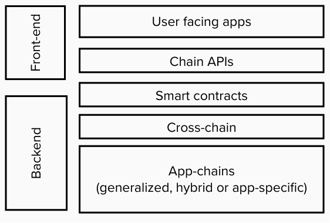

#  I want to build on Polkadot: where do I start? 👷

The Polkadot landscape for builders, where to learn, get involved and how to contribute.
Goal is to give an overview of the types of builders you might identify as in the Polkadot ecosystem and what's out there for you to get started.

WIP draft outline.

---

## Agenda

- Overview of Polkadot’s _builder_ landscape of opportunities
- Where to learn, get involved and how to contribute
- Support and funding

--- 

## Types of builders

* Write code
* Let others write code

---

## Types of builders

Note: attend talk on "the Polkadot tech stack" for a deep dive on this.

---

## I let other people write code 😺

* Ideas, visionary, partnerships
* Project management
* Designer, prototyping, UX
* Research

---

## I write code 🧑‍💻

* Core developer
* Smart contracts developer
* Apps developer

---

Thought: building on Polkadot vs. building in Polkadot, latter is more encompassing.

---

## Building things that..

1. Improve the core protocol ❌
1. Improve ways to build products that use the core protocol ❌

Note: things like async backing, core scheduling, or even frameworks like FRAME to me aren't part of the "build on Polkadot" cluster of things.

---

## Building things that..

1. Require Polkadot's raw resource ✅
    * Parachains, smart contracts
1. Create new services by reusing existing network features  ✅
    * Accord space, composability of services
    * Adding new functionality to base services (e.g. collectives)
1. Provide user experiences around existing services ✅

---

Note: there's sort of a divide between building things to prosper the overall network and building your own things that require the network.

---

## What this translates to 💡

* Libraries for building and maintaining appchains
    * Polkadot SDK
* Tools for deploying and maintaining appchains
* Libraries for interacting with appchains and smart contracts
 
---

## For everything that's appchain logic specific

[ Polkadot SDK -> Substrate -> FRAME ]

---

## For everything that's UIs

[ list libraries, wallets, light client compatibiltiy ]

----

## More things like ... 

Making the network easier to use for developers ✅
* Infrastructure and tooling
* Diverse libraries for interacting with Polkadot and developing appchains

----

## Reality..

It's hard.

Note: see PRs where appchain devs need to make requests to update the core sdk (for e.g #3070 and #2740)

---

## What do you want to build?

Most important starting point 🌈 🦄

---

## Examples of what can be built

* A feeless blockchain that derives economic security from Polkadot
* A custom consensus mechanism
* UTXO Transaction Model
* IoT supply chain traceability solutions

---

## Examples of things designed to prosper the network as a whole

* OpenGov
* Identity
* XCM development

---

## Learning resources

* Polkadot Blockchain Academy
* Polkadot Wiki - Starters Guide
* W3F edX courses
* Substrate Developer Hub

---

## Get support 

* Substrate and Polkadot Hackathons.
* Treasury funded Polkadot Education initiatives.
* W3F grants
* Polkadot Developer Heroes Program

---

## Conclusion

* It's permissionless (*)
* What you want to build / what areas interest you
* Vast landscape of opportunities for experimentation
* Lots of support

--> (*) well, we can talk more about that. I.e. deploying upgrades or new interfaces to existing chains is not the same as deploying contracts!
